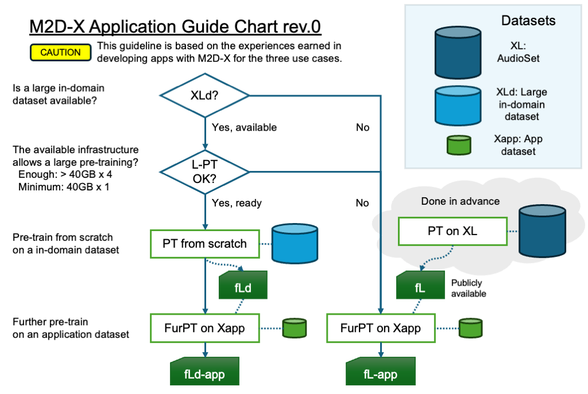

# M2D/M2D-X Application Guide (update: May 25, 2024)

While our papers provide the details of methods, more is needed to guide how to use them in new applications, especially for the pre-training for each purpose.
Here are guides based on the experiences and the information found afterward.

CAUTION: This guide does not provide complete information covering many use cases because we are not working on many applications. Therefore, it is subject to change according to the new information/experience gained.

## 1. Transfer learning only, no pre-training
If you load the pre-trained weight and use the encoder for fine-tuning as a feature extractor, you may choose a weight from ["Pre-trained/Fine-tuned Weights"](README.md#pre-trainedfine-tuned-weights):

- "M2D-AS fine-tuned on AS2M" or "M2D/0.7 fine-tuned on AS2M" -- If your application setting is closer to the AudioSet ontology, including typical audio tagging (AT), sound event detection (SED), and audio captioning. 
- "M2D-AS fine-tuned on AS2M@32kHz" -- If application data needs higher frequency.
- "M2D/0.7", "M2D/0.6", "M2D-AS", or "M2D-AS@32kHz" -- General-purpose weights. If the application domain is far from AudioSet, such as medical or industrial (e.g., factory) sound, or if it is uncertain.
- "M2D-S" -- Weights for speech tasks.


## 2. Pre-training on your data

### 2.1 Pre-training strategy choice

Effective pre-training depends on the available dataset and computing resources.



Possible choices:

- Used the `fL` (AudioSet or LibriSpeech pre-trained weights) as they are -- The provided weights could be effective.
- Pre-training on `XLd` (a large in-domain dataset) from scratch -- As in speech, in-domain pre-training may be possible.
- Further pre-training on `Xapp` (an application dataset).
    - If your `Xapp` is large enough (>1000h), pre-training from scratch on `Xapp` may be effective.

### 2.2 Base weight choice

A weight closer to the application domain may be effective.

- AudioSet pre-trained weights (M2D pre-training) "M2D/0.7" or "M2D/0.6" -- For general non-speech tasks. A respiratory sound task may be non-speech.
    - e.g., m2d_vit_base-80x608p16x16-221006-mr7
- AudioSet pre-trained weights (M2D-AS pre-training) "M2D-AS" -- For typical audio captioning, audio tagging, sound event detection tasks.
    - e.g., m2d_as_vit_base-80x608p16x16-240213
- LibriSpeech pre-trained weights "M2D-S" -- For speech tasks. Note that AudioSet weights may be more effective even for some sounds seemingly closer to speech, such as respiratory sounds.
    - e.g., m2d_s_vit_base-80x400p80x2-230201 or m2d_s_vit_base-80x608p80x2-230220, starting with the 80x400 model would make your experiment easier.

### 2.3 Parameter setting

#### 2.3.1 Pre-training from scratch

Practically, training from scratch may require >100K samples and multiple GPUs. Here's the command line we use to train an M2D.

```sh
OMP_NUM_THREADS=1 torchrun --nproc_per_node=4 train_audio.py --input_size 80x608 --patch_size 16x16 --epochs 300 --batch_size 512 --accum_iter 1 --save_freq 50 --seed 3 --model m2d_vit_base --csv_main data/files_audioset.csv --data_path /path/to/your/data --loss_off 0.
```

The parameters specifically matter for your purpose:

- `--epochs 300 --batch_size 512 --accum_iter 1` -- The combination of these parameters, the learning rate, and the EMA decay parameters matter. The epochs could be adjusted, while longer epochs do not always yield better results. Set the effective batch size to 2048 according to your GPU resources (This example uses 4 GPUs for each 512-sample batch). Following these guides, you may not need to change the learning rate and EMA parameters. The successful settings we have sed so far:
    - bs=2048 & epochs=300 for AudioSet 2M samples.
    - bs=2048 & epochs=1000 for LibriSpeech 281k samples.
- `--csv_main data/files_audioset.csv` -- You may set your data list here.
- `--data_path /path/to/your/data` -- You may set your data folder. I explicitly set this to a fast storage device.
- `--loss_off 0.` -- No offline loss.


#### 2.3.2 Further pre-training

Further pre-training may be a choice that pre-trains a pre-trained model on your data when your data is small, such as <10K samples.
(We have yet to check for how much data you need to pre-train from scratch or do further pre-training.)

Here's the command line we use to train an M2D-X model for ICBHI 2017 (see our TALSP paper for the details).

```sh
CUDA_VISIBLE_DEVICES=0 python train_audio.py --epochs 600 --resume m2d_vit_base-80x200p16x4-230529/checkpoint-300.pth --model m2d_x_vit_base --input_size 80x200 --patch_size 16x4 --batch_size 64 --accum_iter 2 --csv_main data/files_icbhi2017.csv --csv_bg_noise data/files_f_s_d_5_0_k.csv --noise_ratio 0.3 --save_freq 100 --eval_after 600 --seed 6 --teacher m2d_vit_base-80x200p16x4-230529/checkpoint-300.pth --blr 3e-4 --loss_off 1. --min_ds_size 10000
```

The parameters specifically matter for your purpose:

- `--epochs 600 --batch_size 64 --accum_iter 2` -- The combination of these parameters matters. The epochs could be adjusted. Set the effective batch size to 128 according to your GPU resources (This example uses a GPU with a batch size of 64 and accumulating loss twice). Following these guides, you may not need to change the learning rate and EMA parameters. The successful settings we have used so far:
    - bs=128 & epochs=600 for 10k samples. (We virtually increased up to 10k by repeating the list of 1k samples.)
- `--resume m2d_vit_base-80x200p16x4-230529/checkpoint-300.pth ` -- It initializes the online encoder weights using the pre-trained weight.
- `--teacher m2d_vit_base-80x200p16x4-230529/checkpoint-300.pth` -- We also use the model as an offline teacher encoder.
- `--model m2d_x_vit_base` -- Set the pre-training framework as M2D-X.
- `--input_size 80x200 --patch_size 16x4` -- You explicitly need to set them when using non-default parameters.
- `--csv_main data/files_icbhi2017.csv` -- You may set your data list here.
- `--csv_bg_noise data/files_f_s_d_5_0_k.csv` -- Set the BG noise data list here when you set the noise ratio to >0.0.
- `--noise_ratio 0.3` -- Set the mixing ratio of the BG noise. The 0.3 will mix data for main/BG with a proportion of 0.7/0.3.
- `--eval_after 600` -- We skip the evaluation of the checkpoints after the epoch of 600; the intermediate checkpoints will not be tested.
- `--blr 3e-4` -- The default is `3e-4`, so we just set it here in case we want to adjust.
- `--loss_off 1.` -- The offline loss ratio for M2D-X.
- `--min_ds_size 10000` -- We virtually increase the number of samples to 10k by repeating the list of 1k samples.

#### Example use case: Further pre-training with 2 GPUs, bs=32, 50k data samples

This is an example command line for two small GPUs that can accommodate a batch size of 32.

```sh
CUDA_VISIBLE_DEVICES=0,1 torchrun --nproc_per_node=2 train_audio.py --epochs 600 --warmup_epochs 24 --resume m2d_vit_base-80x608p16x16-221006-mr7/checkpoint-300.pth --model m2d_x_vit_base --batch_size 32 --accum_iter 4 --csv_main __your__.csv --csv_bg_noise data/files_f_s_d_5_0_k.csv --noise_ratio 0.01 --save_freq 100 --eval_after 600 --seed 3 --teacher m2d_vit_base-80x608p16x16-221006-mr7/checkpoint-300.pth --blr 3e-4 --loss_off 1.
```

We set options for the setup.

- `torchrun --nproc_per_node=2` -- For the distributed training using two GPUs.
- `--batch_size 32 --accum_iter 4` -- For the effective batch size of 128.
- Removed `--min_ds_size 10000` because the number of data samples would be enough to form an epoch.

## 3. Notes on pre-training

#### a. Batch size, learning rate scheduling, and EMA

The M2D combines the masked prediction pretext task with recent SSL techniques, such as the offline network updated by EMA and the annealing learning rate schedule, making the pre-training settings somewhat tricky. Here are some related notes.

- How the offline target encoder evolves relates to the effective batch size because the system updates it by EMA every time batch samples are consumed. Thus, the effective batch size (batch size by accum_iter) matters for gaining a useful training signal created by the offline encoder.
- Other factors that affect the offline target encoder are the number of epochs and the data size.
- In summary, the effective batch size, number of epochs, data size, and EMA parameters control how we get good training signals.

However, searching for a set of these parameters takes time. Thus, using a similar set of parameters known to be effective is recommended.

