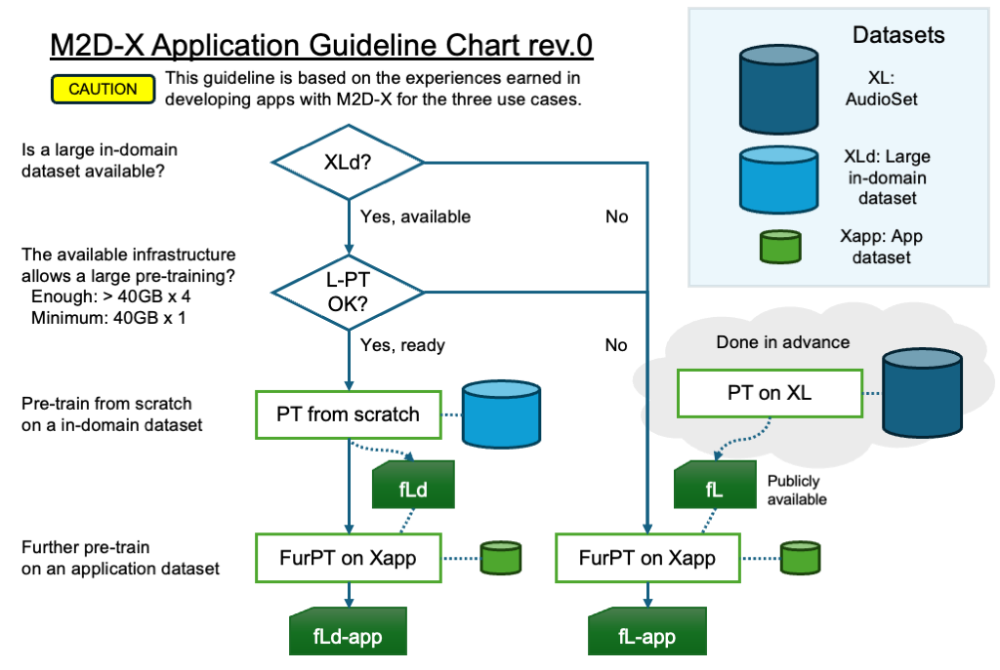

# M2D-X Application Guideline (alpha)

While we provide information in the papers, we know that more is needed to guide new applications to try pre-training or further pre-training for their purposes.
Here, we provide guidelines based on the experiences and the information found afterward.

CAUTION: These guidelines cannot fully cover the use cases because we are not working on many applications. We update guidelines whenever we find something new.

## Pre-training strategy choice

Effective pre-training depends on the available dataset and computing resources.

Possible choices:

- Used the `fL` (AudioSet or LibriSpeech pre-trained weights) as they are -- The provided weights could be effective.
- Pre-training on `XLd` (a large in-domain dataset) from scratch -- As in speech, in-domain pre-training may be possible.
- Further pre-training on `Xapp` (an application dataset).
    - If your `Xapp` is large enough (>1000h), pre-training from scratch on `Xapp` may be effective.

## Base weight choice

A weight closer to the application domain may be effective.

- AudioSet pre-trained weights -- for non-speech tasks. A respiratory sound task may be non-speech.
    - e.g., m2d_vit_base-80x608p16x16-221006-mr7
- LibriSpeech pre-trained weights -- for speech tasks. Note that we experienced that respiratory sounds may be non-speech.
    - e.g., m2d_s_vit_base-80x400p80x2-230201 or m2d_s_vit_base-80x608p80x2-230220, starting with the 80x400 model would make your experiment easier.
