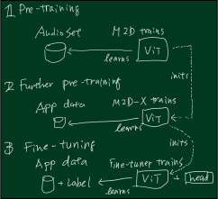

<figure>
  
</figure>

# Masked Modeling Duo (M2D)

This repository provides demo implementations of our paper "[Masked Modeling Duo: Towards a Universal Audio Pre-training Framework](https://ieeexplore.ieee.org/document/10502167)", "[Masked Modeling Duo: Learning Representations by Encouraging Both Networks to Model the Input](https://arxiv.org/abs/2210.14648)", and so on.

## Pre-trained/Fine-tuned Weights

### AudioSet pre-trained weights

| Weight        | Recommendation  | Description | Fur-PT Ready | AS2M mAP |
|:--------------|:----------------|:------------|:------:|:--------:|
| [m2d_as_vit_base-80x1001p16x16-240213_AS-FT_enconly](https://github.com/nttcslab/m2d/releases/download/v0.3.0/m2d_as_vit_base-80x1001p16x16-240213_AS-FT_enconly.zip) | Best for audio tagging (AT) / sound event detection (SED).| M2D-AS fine-tuned on AS2M | N/A | 0.485 |
| [m2d_vit_base-80x1001p16x16-221006-mr7_as_46ab246d](https://github.com/nttcslab/m2d/releases/download/v0.3.0/m2d_vit_base-80x1001p16x16-221006-mr7_as_46ab246d.zip) | 2nd best for AT/SED. | M2D/0.7 fine-tuned on AS2M | N/A | 0.479 |
| [m2d_vit_base-80x200p16x4-230529](https://github.com/nttcslab/m2d/releases/download/v0.1.0/m2d_vit_base-80x200p16x4-230529.zip) | General-purpose transfer learning and further pre-training w/ finer time frame. | M2D/0.7 (t.f. 40ms) | ✅ | - |
| [m2d_as_vit_base-80x608p16x16-240213](https://github.com/nttcslab/m2d/releases/download/v0.1.0/m2d_as_vit_base-80x608p16x16-240213.zip) | General-purpose transfer learning and further pre-training, especially when application data is closer to the AudioSet ontology. | M2D-AS | ✅ | - |
| [m2d_vit_base-80x608p16x16-221006-mr7](https://github.com/nttcslab/m2d/releases/download/v0.1.0/m2d_vit_base-80x608p16x16-221006-mr7.zip) | General-purpose transfer learning and further pre-training. | M2D/0.7 | ✅ | - |
| [m2d_vit_base-80x608p16x16-221006-mr6](https://github.com/nttcslab/m2d/releases/download/v0.1.0/m2d_vit_base-80x608p16x16-221006-mr6.zip) | General-purpose transfer learning and further pre-training. | M2D/0.6 | ✅ | - |
| [m2d_vit_base-80x608p16x16-221006-mr7_enconly](https://github.com/nttcslab/m2d/releases/download/v0.1.0/m2d_vit_base-80x608p16x16-221006-mr7_enconly.zip) | General-purpose transfer learning. (Encoder only) | M2D/0.7 | N/A | - |
| [m2d_vit_base-80x608p16x16-220930-mr7_enconly](https://github.com/nttcslab/m2d/releases/download/v0.1.0/m2d_vit_base-80x608p16x16-220930-mr7_enconly.zip) | General-purpose transfer learning. (Encoder only) | M2D/0.7 | N/A | - |

| Weight        | Recommendation  | Description | Fur-PT Ready | AS2M mAP |
|:--------------|:----------------|:------------|:------:|:--------:|
| [m2d_as_vit_base-80x1001p16x16p32k-240413_AS-FT_enconly](https://github.com/nttcslab/m2d/releases/download/v0.3.0/m2d_as_vit_base-80x1001p16x16p32k-240413_AS-FT_enconly.zip) | Best for audio tagging (AT) / sound event detection (SED) at 32 kHz.| M2D-AS fine-tuned on AS2M@32kHz | N/A | 0.480 |
| [m2d_as_vit_base-80x608p16x16p32k-240413_enconly](https://github.com/nttcslab/m2d/releases/download/v0.1.0/m2d_as_vit_base-80x608p16x16p32k-240413_enconly.zip) | General-purpose transfer learning at 32 kHz. (Encoder only) | M2D-AS@32kHz | N/A | - |

### LibriSpeech pre-trained weights

| Weight        | Recommendation  | Description | Fur-PT Ready | AS2M mAP |
|:--------------|:----------------|:------------|:------:|:--------:|
| [m2d_s_vit_base-80x608p80x2-230220](https://github.com/nttcslab/m2d/releases/download/v0.2.0/m2d_s_vit_base-80x608p80x2-230220.zip) | Speech transfer learning and further pre-training. | M2D-S/0.6 6-s input | ✅ | - |
| [m2d_s_vit_base-80x512p80x2-230301](https://github.com/nttcslab/m2d/releases/download/v0.2.0/m2d_s_vit_base-80x512p80x2-230301.zip) | Speech transfer learning and further pre-training. | M2D-S/0.6 5-s input | ✅ | - |
| [m2d_s_vit_base-80x400p80x2-230201](https://github.com/nttcslab/m2d/releases/download/v0.2.0/m2d_s_vit_base-80x400p80x2-230201.zip) | Speech transfer learning and further pre-training. | M2D-S/0.6 4-s input | ✅ | - |


## Quick Start

| Description | Notebook |
|:------------|:---------|
| Audio tagging example | [ examples/Colab_M2D_example_Tagging.ipynb](http://colab.research.google.com/github/nttcslab/m2d/blob/master/examples/Colab_M2D_example_Tagging.ipynb) |
| Feature extraction example | (TBD) |

You can use simple code to load an M2D model and encode your audio.

```python
# Create a model and load pre-trained weights.
from examples.portable_m2d import PortableM2D  # The portable_m2d is a simple one-file loader.
model = PortableM2D('m2d_as_vit_base-80x1001p16x16-240213_AS-FT_enconly/weights_ep69it3124-0.48494.pth')

# Prepare test audios. (a dummy example of three 10-s waveforms)
import torch
batch_audio = 2 * torch.rand((3, 10 * 16000)) - 1.0 # input range = [-1., 1]

# Encode raw audio into frame-level features.
frame_level = model(batch_audio)
print(frame_level.shape)  # torch.Size([3, 63, 3840]). 3 frame-level 3840-d feature vectors for 63 time frames.

# Make clip-level features by averaging frame-level features along time frames.
clip_level = torch.mean(frame_level, dim=1)
print(clip_level.shape)  # torch.Size([3, 3840])
```

## Application Resources

👉 [**Application Guide (alpha) is available.**](Guide_app.md) -- Our guidelines may provide useful information on how to plan further pre-train your models.
<figure>
  <a href="Guide_app.md"></a>
</figure>

- [👉 **Resources for M2D-X medical applications (ICBHI2017/SPRSound), further pre-training examples**](app/icbhi_sprs/README_ICBHI_SPRS.md).
- [👉 **Resources for M2D medical application (CirCor DigiScope heart sound)**](app/circor/README.md).
- [👉 **Resources for M2D-AS (M2D-X specialized in AudioSet)**](audioset/README.md).
- [👉 **Resources for M2D-S (M2D-X specialized in Speech)**](speech/README.md).
- TBD Preparing one more thing.

A schematic illustration of M2D-X further pre-training:
<figure>
  
</figure>

## 1. Setup

The repository is based on the codes from [facebookresearch/mae](https://github.com/facebookresearch/mae), and we patch our changes on these files.

1. Download external source files and apply a patch.

    ```sh
    git clone https://github.com/nttcslab/m2d.git
    cd m2d
    curl -o util/lars.py https://raw.githubusercontent.com/facebookresearch/mae/efb2a8062c206524e35e47d04501ed4f544c0ae8/util/lars.py
    curl -o util/lr_decay.py https://raw.githubusercontent.com/facebookresearch/mae/efb2a8062c206524e35e47d04501ed4f544c0ae8/util/lr_decay.py
    curl -o util/lr_sched.py https://raw.githubusercontent.com/facebookresearch/mae/efb2a8062c206524e35e47d04501ed4f544c0ae8/util/lr_sched.py
    curl -o util/misc.py https://raw.githubusercontent.com/facebookresearch/mae/efb2a8062c206524e35e47d04501ed4f544c0ae8/util/misc.py
    curl -o util/analyze_repr.py https://raw.githubusercontent.com/daisukelab/general-learning/master/SSL/analyze_repr.py
    curl -o m2d/pos_embed.py https://raw.githubusercontent.com/facebookresearch/mae/efb2a8062c206524e35e47d04501ed4f544c0ae8/util/pos_embed.py
    curl -o train_audio.py https://raw.githubusercontent.com/facebookresearch/mae/efb2a8062c206524e35e47d04501ed4f544c0ae8/main_pretrain.py
    curl -o speech/train_speech.py https://raw.githubusercontent.com/facebookresearch/mae/efb2a8062c206524e35e47d04501ed4f544c0ae8/main_pretrain.py
    curl -o audioset/train_as.py https://raw.githubusercontent.com/facebookresearch/mae/efb2a8062c206524e35e47d04501ed4f544c0ae8/main_pretrain.py
    curl -o mae_train_audio.py https://raw.githubusercontent.com/facebookresearch/mae/efb2a8062c206524e35e47d04501ed4f544c0ae8/main_pretrain.py
    curl -o m2d/engine_pretrain_m2d.py https://raw.githubusercontent.com/facebookresearch/mae/efb2a8062c206524e35e47d04501ed4f544c0ae8/engine_pretrain.py
    curl -o m2d/models_mae.py https://raw.githubusercontent.com/facebookresearch/mae/efb2a8062c206524e35e47d04501ed4f544c0ae8/models_mae.py
    curl -o m2d/timm_layers_pos_embed.py https://raw.githubusercontent.com/huggingface/pytorch-image-models/e9373b1b925b2546706d78d25294de596bad4bfe/timm/layers/pos_embed.py
    patch -p1 < patch_m2d.diff
    ```

2. Install external modules listed on [requirements.txt](requirements.txt).

    ```sh
    pip install -r requirements.txt
    ```

## 2. Evaluating M2D

We use the [EVAR](https://github.com/nttcslab/eval-audio-repr) for our evaluation.

### 2-1. Setup EVAR

[EVAR](https://github.com/nttcslab/eval-audio-repr) is an evaluation package for audio representations used by our research papers such as [BYOL-A](https://ieeexplore.ieee.org/document/9944865).

The following steps setup EVAR.

1. In the folder of your copy of the M2D repository, clone the EVAR repository and prepare basic items.

    ```sh
    (cd to your M2D folder)
    git clone https://github.com/nttcslab/eval-audio-repr.git evar
    cd evar
    curl https://raw.githubusercontent.com/daisukelab/general-learning/master/MLP/torch_mlp_clf2.py -o evar/utils/torch_mlp_clf2.py
    curl https://raw.githubusercontent.com/daisukelab/sound-clf-pytorch/master/for_evar/sampler.py -o evar/sampler.py
    curl https://raw.githubusercontent.com/daisukelab/sound-clf-pytorch/master/for_evar/cnn14_decoupled.py -o evar/cnn14_decoupled.py
    cd ..
    ```

2. Setup downstream task datasets according to [Preparing-datasets.md](https://github.com/nttcslab/eval-audio-repr/blob/main/Preparing-datasets.md). The following is an example for setting up CREMA-D dataset.

    ```sh
    cd evar
    python evar/utils/download_cremad.py downloads/cremad
    python prepare_wav.py downloads/cremad work/16k/cremad 16000
    cd ..
    ```

### 2-2. Linear Evaluation

Once you setup the EVAR, you can evaluate your models as follows.

- For evaluating a model with an absolute path `/your/path/to/model.pth`.

    ```sh
    cd evar
    python lineareval.py config/m2d.yaml cremad weight_file=/your/path/to/model.pth
    ```

- If you want to save GPU memory, set a fewer batch size as follows. This example sets it as 16.

    ```sh
    cd evar
    python lineareval.py config/m2d.yaml cremad batch_size=16,weight_file=/your/path/to/model.pth
    ```

We used the `all_eval.sh` script to evaluate on all downstream tasks.

### 2-3. Fine-tuning

We have fin-tuned our models using the scripts in the `util` folder.

The following examples will fine-tune on each task for three times with the random seed 43, 44, and 45, and the `m2d_vit_base-80x608p16x16-221006-mr7/checkpoint-300.pth`  will be tested. Replace the `/your/path/to/m2d_vit_base-80x608p16x16-221006-mr7` to yours.

```sh
cd evar
bash (your m2d)/util/ft-as2m.sh /your/path/to/m2d_vit_base-80x608p16x16-221006-mr7 3 42 300
bash (your m2d)/util/ft-as0k.sh /your/path/to/m2d_vit_base-80x608p16x16-221006-mr7 3 42 300
bash (your m2d)/util/ft-esc50.sh /your/path/to/m2d_vit_base-80x608p16x16-221006-mr7 3 42 300
bash (your m2d)/util/ft-spc.sh /your/path/to/m2d_vit_base-80x608p16x16-221006-mr7 3 42 300
bash (your m2d)/util/ft-vc1.sh /your/path/to/m2d_vit_base-80x608p16x16-221006-mr7 3 42 300
```

#### NOTE: Please set your data path in the `util/ft-as2m.sh`

The `ft-as2m.sh` requires the path to your log-mel spectrogram AudioSet samples in .npy, configure the script with yours.

## 3. Pre-training From Scratch

### 3-1. Prepare pre-training data samples

The pre-trainer (e.g., `train_audio.py` for audio) loads data from the `data` folder by default (`--data_path`), using a list of samples in a CSV `data/files_audioset.csv` by default (`--dataset`).
Follow the steps in [data/README.md](data/README.md).

The following is an example using the [FSD50K](https://arxiv.org/abs/2010.00475) dataset.

1. Preprocess .wav files into log-mel spectrogram .npy files. The following converts from a source folder `/your/local/fsd50k/FSD50K.dev_audio` to a new folder `data/fsd50k_lms`.

    ```sh
    python wav_to_lms.py /your/local/fsd50k/FSD50K.dev_audio data/fsd50k_lms
    ```

2. Create a CSV file that will be used as a list of pre-training samples, containing a single column `file_name`. The following example creates `files_f_s_d_5_0_k.csv`.

    ```sh
    echo file_name > data/files_f_s_d_5_0_k.csv
    (cd data && find fsd50k_lms/FSD50K.dev_audio -name "*.npy") >> data/files_f_s_d_5_0_k.csv
    ```

Example of created folder structure:

    data/
        files_f_s_d_5_0_k.csv
        fsd50k_lms/
            FSD50K.dev_audio/
                2931.npy
                408195.npy
                    :

### 3-2. Start pre-training

Once your data is ready, start pre-training as follows.

```sh
python train_audio.py --dataset data/files_fssd50k.csv
```

### 3-3. Evalidation during and after the training

The training loop automatically evaluates the pre-trained model.

- During pre-training, `train_audio.py` runs a script called `quick_eval.sh` as a sub-process. You can edit `quick_eval.sh` for your purposes.
- When the pre-training is finished, the final evaluation script `all_eval.sh` is executed.

### 3-4. Complete pre-training command lines

The command lines for pre-training full-performance models follow:

```sh
# M2D
OMP_NUM_THREADS=1 torchrun --nproc_per_node=4 -m train_audio --input_size 80x608 --patch_size 16x16 --epochs 300 --batch_size 512 --accum_iter 1 --save_freq 50 --seed 3 --model m2d_vit_base --csv_main data/files_audioset.csv --data_path /path/to/your/data --loss_off 0.
# M2D-AS
OMP_NUM_THREADS=1 torchrun --nproc_per_node=4 -m audioset.train_as --input_size 80x608 --patch_size 16x16 --epochs 300 --batch_size 512 --accum_iter 1 --save_freq 50 --seed 3 --data_path /path/to/your/data --loss_off 1.
```

Example logs are available: [example_logs.zip](https://github.com/nttcslab/m2d/releases/download/v0.1.0/example_logs.zip).

We explain the details in the [Guide_app.md](Guide_app.md).

## 4. Other Pre-trained/fine-tuned Weights

Please find all pre-trained/fine-tuned weights published on the [releases](https://github.com/nttcslab/m2d/releases).

## 5. License

See [LICENSE.pdf](LICENSE.pdf) for details.

## Citations

If you find our M2D useful in your research, please consider citing our papers.

```BibTeX
@article{niizumi2024m2dx,
    title   = {{Masked Modeling Duo: Towards a Universal Audio Pre-training Framework}},
    author  = {Daisuke Niizumi and Daiki Takeuchi and Yasunori Ohishi and Noboru Harada and Kunio Kashino},
    journal = {IEEE/ACM Trans. Audio, Speech, Language Process.},
    year    = {2024},
    volume  = {32},
    pages   = {2391-2406},
    url     = {https://ieeexplore.ieee.org/document/10502167},
    doi     = {10.1109/TASLP.2024.3389636}}

@inproceedings{niizumi2023m2d,
    title   = {{Masked Modeling Duo: Learning Representations by Encouraging Both Networks to Model the Input}},
    author  = {Daisuke Niizumi and Daiki Takeuchi and Yasunori Ohishi and Noboru Harada and Kunio Kashino},
    booktitle={ICASSP 2023 - 2023 IEEE International Conference on Acoustics, Speech and Signal Processing (ICASSP)}, 
    year    = {2023},
    url     = {https://ieeexplore.ieee.org/document/10097236},
    doi     = {10.1109/ICASSP49357.2023.10097236}}

@inproceedings{niizumi2023m2d4speech,
    title   = {{Masked Modeling Duo for Speech: Specializing General-Purpose Audio Representation to Speech using Denoising Distillation}},
    author  = {Daisuke Niizumi and Daiki Takeuchi and Yasunori Ohishi and Noboru Harada and Kunio Kashino},
    year    = {2023},
    booktitle={Proc. INTERSPEECH 2023},
    pages   = {1294--1298},
    doi     = {10.21437/Interspeech.2023-221}}

@article{niizumi2024embc,
    title   = {{Exploring Pre-trained General-purpose Audio Representations for Heart Murmur Detection}},
    author  = {Daisuke Niizumi and Daiki Takeuchi and Yasunori Ohishi and Noboru Harada and Kunio Kashino},
    journal = {to appear at IEEE EMBC},
    year    = {2024},
    url     = {https://arxiv.org/abs/2404.17107}}
```

## Acknowledgements

- Our code is based on the [MAE PyTorch/GPU re-implementation](https://github.com/facebookresearch/mae) of the paper [Masked Autoencoders Are Scalable Vision Learners](https://openaccess.thecvf.com/content/CVPR2022/html/He_Masked_Autoencoders_Are_Scalable_Vision_Learners_CVPR_2022_paper.html).
- We use [nnAudio](https://ieeexplore.ieee.org/document/9174990) ([KinWaiCheuk/nnAudio](https://github.com/KinWaiCheuk/nnAudio)) for converting raw audio into log-mel spectrogram.

We appreciate these publicly available implementations and all the modules our experiments heavily depend on!

## References

- MAE: *[Kaiming He, Xinlei Chen, Saining Xie, Yanghao Li, Piotr Dollár, and Ross Girshick "Masked Autoencoders Are Scalable Vision Learners," Proceedings of the IEEE/CVF Conference on Computer Vision and Pattern Recognition (CVPR), 2022, pp. 16000-16009](https://openaccess.thecvf.com/content/CVPR2022/html/He_Masked_Autoencoders_Are_Scalable_Vision_Learners_CVPR_2022_paper.html).*
- FSD50K: *[Eduardo Fonseca and Xavier Favory and Jordi Pons and Frederic Font and Xavier Serra, “FSD50K: an Open Dataset of Human-Labeled Sound Events,” in IEEE/ACM Transactions on Audio, Speech, and Language Processing, vol. 30, pp. 829-852, 2022](https://ieeexplore.ieee.org/document/9645159).*
- MSM-MAE: *[Daisuke Niizumi, Daiki Takeuchi, Yasunori Ohishi, Noboru Harada, and Kunio Kashino "Masked Spectrogram Modeling using Masked Autoencoders for Learning General-purpose Audio Representation," HEAR: Holistic Evaluation of Audio Representations (NeurIPS 2021 Competition), PMLR 166:1-24, 2022](https://proceedings.mlr.press/v166/niizumi22a.html).*
