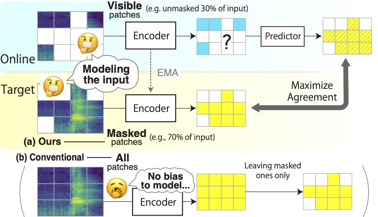

# Masked Modeling Duo (M2D)

This repository provides demo implementations of the following papers:

- "[Masked Modeling Duo: Learning Representations by Encouraging Both Networks to Model the Input](https://arxiv.org/abs/2210.14648)"
- "[Masked Modeling Duo for Speech: Specializing General-Purpose Audio Representation to Speech using Denoising Distillation](https://arxiv.org/abs/2305.14079)"

You can find the following.

- Code for pre-training, linear evaluation, and fine-tuning.
- Pre-trained weights.

If you find our M2D useful in your research, please consider citing our paper:

```BibTeX
@INPROCEEDINGS{niizumi2023m2d,
    title   = {{Masked Modeling Duo: Learning Representations by Encouraging Both Networks to Model the Input}},
    author  = {Daisuke Niizumi and Daiki Takeuchi and Yasunori Ohishi and Noboru Harada and Kunio Kashino},
    booktitle={ICASSP 2023 - 2023 IEEE International Conference on Acoustics, Speech and Signal Processing (ICASSP)}, 
    year    = {2023},
    url     = {https://ieeexplore.ieee.org/document/10097236},
    doi     = {10.1109/ICASSP49357.2023.10097236}}
}

@inproceedings{niizumi2023m2d4speech,
    title   = {{Masked Modeling Duo for Speech: Specializing General-Purpose Audio Representation to Speech using Denoising Distillation}},
    author  = {Daisuke Niizumi and Daiki Takeuchi and Yasunori Ohishi and Noboru Harada and Kunio Kashino},
    year    = {2023},
    booktitle={Proc. INTERSPEECH 2023},
    pages   = {1294--1298},
    doi     = {10.21437/Interspeech.2023-221}
}
```

## M2D For Speech (M2D-S)

👉 Please visit [speech folder](speech/README.md).

## 1. Getting Started

The repository is based on the codes from [facebookresearch/mae](https://github.com/facebookresearch/mae), and we patch our changes on these files.

1. Download external source files from [facebookresearch/mae](https://github.com/facebookresearch/mae), and apply a patches.

```sh
curl -o util/lars.py https://raw.githubusercontent.com/facebookresearch/mae/efb2a8062c206524e35e47d04501ed4f544c0ae8/util/lars.py
curl -o util/lr_decay.py https://raw.githubusercontent.com/facebookresearch/mae/efb2a8062c206524e35e47d04501ed4f544c0ae8/util/lr_decay.py
curl -o util/lr_sched.py https://raw.githubusercontent.com/facebookresearch/mae/efb2a8062c206524e35e47d04501ed4f544c0ae8/util/lr_sched.py
curl -o util/misc.py https://raw.githubusercontent.com/facebookresearch/mae/efb2a8062c206524e35e47d04501ed4f544c0ae8/util/misc.py
curl -o m2d/pos_embed.py https://raw.githubusercontent.com/facebookresearch/mae/efb2a8062c206524e35e47d04501ed4f544c0ae8/util/pos_embed.py
curl -o train_audio.py https://raw.githubusercontent.com/facebookresearch/mae/efb2a8062c206524e35e47d04501ed4f544c0ae8/main_pretrain.py
curl -o train_speech.py https://raw.githubusercontent.com/facebookresearch/mae/efb2a8062c206524e35e47d04501ed4f544c0ae8/main_pretrain.py
curl -o mae_train_audio.py https://raw.githubusercontent.com/facebookresearch/mae/efb2a8062c206524e35e47d04501ed4f544c0ae8/main_pretrain.py
curl -o m2d/engine_pretrain_m2d.py https://raw.githubusercontent.com/facebookresearch/mae/efb2a8062c206524e35e47d04501ed4f544c0ae8/engine_pretrain.py
curl -o m2d/models_mae.py https://raw.githubusercontent.com/facebookresearch/mae/efb2a8062c206524e35e47d04501ed4f544c0ae8/models_mae.py
curl -o m2d/timm_layers_pos_embed.py https://raw.githubusercontent.com/huggingface/pytorch-image-models/e9373b1b925b2546706d78d25294de596bad4bfe/timm/layers/pos_embed.py
patch -p1 < patch_m2d.diff
```

2. If you need a clean environment, the following [anaconda](https://www.anaconda.com/products/distribution) example creates a new environment named `ar`:

```sh
conda create -n ar python==3.8
conda activate ar
```

3. Install external modules listed on [requirements.txt](requirements.txt).

### 1-1. Quick example

We have a utility runtime model utility, RuntimeM2D, that helps you to load a pre-trained model and encode your audio.

```python
from m2d.runtime_audio import RuntimeM2D

device = torch.device('cpu')  # set 'cuda' if you run on a GPU

# Prepare your batch of audios. This is a dummy  example of three 10s  waves.
batch_audio = 2 * torch.rand((3, 10 * 16000)) - 1.0 # input range = [-1., 1]
batch_audio = batch_audio.to(device)

# Create a model with pretrained weights.
runtime = RuntimeM2D(weight_file='m2d_vit_base-80x608p16x16-220930-mr7/checkpoint-300.pth')
runtime = runtime.to(device)

# Encode raw audio into features. `encode()` will do the followings automatically:
# 1. Convert the input `batch_audio` to log-mel spectrograms (LMS).
# 2. Normalize the batch LMS with mean and std calculated from the batch.
# 3. Encode the bach LMS to features.
frame_level = runtime.encode(batch_audio)

# This example ends up with frame-level 3840-d feature vectors for 63 time frames.
# The `frame_level` will have a size of torch.Size([3, 63, 3840]).
print(frame_level.shape)

#  You can get clip-level features by taking average of time franes.
# The `clip_level` will have a size of torch.Size([3, 3840])
clip_level = torch.mean(frame_level, dim=1)
print(clip_level.shape)
```

To get the best features, you can normalize your audio with normalization statistics of your entire input data and use them in your pipeline.

```python
# Calculate statistics in advance. This is an example with 10 random waves.
means, stds = [], []
for _ in range(10):
    lms = runtime.to_feature(torch.rand((10 * 16000)).to(device))
    means.append(lms.mean())
    stds.append(lms.std())

dataset_mean, dataset_std = torch.mean(torch.stack(means)), torch.mean(torch.stack(stds))
# These can be numbers [-5.4919195, 5.0389895], for example.

# The followings are an example pipeline.

# Convert your batch audios into LMS.
batch_lms = runtime.to_feature(batch_audio)
# Normalize them.
batch_lms = (batch_lms - dataset_mean) / (dataset_std + torch.finfo().eps)
# Encode them to feame-level features.
frame_level = runtime.encode_lms(batch_lms)
#  Calculate clip-level features if needed.
clip_level = torch.mean(frame_level, dim=1)
```

To get features per layer, you can add `return_layers=True`.

```python
# Getting features per layer.
y = runtime.encode_lms(torch.rand(10, 1, 80, 900), return_layers=True)
print(len(y), y[0].shape)
# --> 12 torch.Size([10, 57, 3840])

# As normal, getting finale-layer features.
y = runtime.encode_lms(torch.rand(10, 1, 80, 900), return_layers=False)
print(y.shape)
# --> torch.Size([10, 57, 3840])
```

## 2. Evaluating M2D

We use the [EVAR](https://github.com/nttcslab/eval-audio-repr) as an evaluation platform.

### 2-1. Setup EVAR

[EVAR](https://github.com/nttcslab/eval-audio-repr) is an evaluation package for audio representations used by our research papers such as [BYOL-A](https://ieeexplore.ieee.org/document/9944865) and [Composing General Audio Representation by Fusing Multilayer Features of a Pre-trained Model](https://ieeexplore.ieee.org/document/9909674).
It supports the following downstream tasks: ESC-50, US8K, FSD50K, SPCV1/V2, VoxForge, VoxCeleb1, CREMA-D, GTZAN, NSynth instrument family, Pitch Audio Dataset (Surge synthesizer), and AudioSet20K.

The following steps setup EVAR.

1. In the folder of your copy of the M2D repository, clone the EVAR repository and prepare basic items.

    ```sh
    (cd to your M2D folder)
    git clone https://github.com/nttcslab/eval-audio-repr.git evar
    cd evar
    curl https://raw.githubusercontent.com/daisukelab/general-learning/master/MLP/torch_mlp_clf2.py -o evar/utils/torch_mlp_clf2.py
    curl https://raw.githubusercontent.com/daisukelab/sound-clf-pytorch/master/for_evar/sampler.py -o evar/sampler.py
    curl https://raw.githubusercontent.com/daisukelab/sound-clf-pytorch/master/for_evar/cnn14_decoupled.py -o evar/cnn14_decoupled.py
    cd ..
    ```

2. Setup downstream task datasets according to [Preparing-datasets.md](https://github.com/nttcslab/eval-audio-repr/blob/main/Preparing-datasets.md). The following is an example for setting up CREMA-D dataset.

    ```sh
    cd evar
    python evar/utils/download_cremad.py downloads/cremad
    python prepare_wav.py downloads/cremad work/16k/cremad 16000
    cd ..
    ```

### 2-2. Linear Evaluation

Once you setup the EVAR, you can evaluate your models as follows.

- For evaluating a model with an absolute path `/your/path/to/model.pth`.

    ```sh
    cd evar
    python lineareval.py config/m2d.yaml cremad weight_file=/your/path/to/model.pth
    ```

- If you want to save GPU memory, set a fewer batch size as follows. This example sets it as 16.

    ```sh
    cd evar
    python lineareval.py config/m2d.yaml cremad batch_size=16,weight_file=/your/path/to/model.pth
    ```

We used the `all_eval.sh` script to evaluate on all downstream tasks.

### 2-3. Fine-tuning

We have fin-tuned our models using the following command lines. Replace the `/your/path/to/model.pth` to yours.

```sh
cd evar
python finetune.py config/m2d.yaml as20k weight_file=/your/path/to/model.pth --lr 1.0 --freq_mask 0 --time_mask 0 --training_mask 0.5 --mixup 0.3 --rrc True --seed 0
python finetune.py config/m2d.yaml esc50 weight_file=/your/path/to/model.pth --lr 0.5 --freq_mask 0 --time_mask 0 --training_mask 0.5 --mixup 0.0 --rrc True --seed 0
python finetune.py config/m2d.yaml spcv2 weight_file=/your/path/to/model.pth --lr 0.5 --freq_mask 0 --time_mask 0 --training_mask 0.5 --mixup 0.3 --rrc True --seed 0
python finetune.py config/m2d.yaml vc1 weight_file=/your/path/to/model.pth --optim adamw --lr 0.001 --freq_mask 0 --time_mask 0 --training_mask 0.0 --mixup 0.0 --rrc False --seed 0
```

To allow fine-tuning on a small GPU, add an option to decrease the batch size, for example `--batch_size 64`. You may want to decrease the learning rate (`--lr LR`) when using smaller batches.

## 3. Pre-training From Scratch

### 3-1. Preparing pre-training data samples

The pre-trainer (e.g., `train_audio.py` for audio) loads data from the `data` folder by default (`--data_path`), using a list of samples in a CSV `data/files_audioset.csv` by default (`--dataset`).
Follow the steps in [data/README.md](data/README.md).

The following is an example using the [FSD50K](https://arxiv.org/abs/2010.00475) dataset.

1. Preprocess .wav files into log-mel spectrogram .npy files. The following converts from a source folder `/your/local/fsd50k/FSD50K.dev_audio` to a new folder `data/fsd50k_lms`.

    ```sh
    python wav_to_lms.py /your/local/fsd50k/FSD50K.dev_audio data/fsd50k_lms
    ```

2. Create a CSV file that will be used as a list of pre-training samples, containing a single column `file_name`. The following example creates `files_fsd50k.csv`.

    ```sh
    echo file_name > data/files_fsd50k.csv
    (cd data && find fsd50k_lms -name "*.npy") >> data/files_fsd50k.csv
    ```

Example of created folder structure:

    data/
        audioset_lms/
          :
        fsd50k_lms/
            FSD50K.dev_audio/
                2931.npy
                408195.npy
                    :

### 3-2. Starting pre-training

Once your data is ready, start pre-training as follows.

```sh
python train_audio.py --dataset data/files_fssd50k.csv
```

### 3-3. Automatic evalidation during and after training

The training loop automatically evaluates the pre-trained model.

- During pre-training, `train_audio.py` runs a script called `quick_eval.sh` as a sub-process. You can edit `quick_eval.sh` for your purposes.
- When the pre-training is finished, the final evaluation script `all_eval.sh` is executed.

## 4. Pre-trained Weights

Three pre-trained weights are published on the [releases](https://github.com/nttcslab/m2d/releases),
and the followings are their EVAR task results:

| weight             | esc50   | us8k   | spcv2   | vc1   | voxforge   | cremad   | gtzan   | nsynth   | surge   |
|:-------------------|:--------|:-------|:--------|:------|:-----------|:---------|:--------|:---------|:--------|
| msm_mae_vit_base-80x608p16x16-220924-mr75  | 88.6%   | 86.3%  | 94.5%   | 72.2% | 97.5%      | 70.2%    | 78.4%   | 75.9%    | 42.5%   |
| m2d_vit_base-80x608p16x16-221006-mr6  | 89.7%   | 87.6%  | 95.4%   | 73.1% | 97.9%      | 71.7%    | 83.3%   | 75.3%    | 41.0%   |
| m2d_vit_base-80x608p16x16-220930-mr7 | 89.8%   | 87.1%  | 94.5%   | 71.3% | 97.7%      | 71.6%    | 83.9%   | 76.9%    | 41.8%   |

- The `msm_mae_vit_base-80x608p16x16-220924-mr75` is the MSM-MAE pre-trained model compared in M2D paper.
- The `mr6` and `mr7` denote masking ratios of 0.6 and 0.7, respectively.

## 5. License

See [LICENSE.pdf](LICENSE.pdf) for details.

## Acknowledgements

- Our code is based on the [MAE PyTorch/GPU re-implementation](https://github.com/facebookresearch/mae) of the paper [Masked Autoencoders Are Scalable Vision Learners](https://openaccess.thecvf.com/content/CVPR2022/html/He_Masked_Autoencoders_Are_Scalable_Vision_Learners_CVPR_2022_paper.html).
- We use [nnAudio](https://ieeexplore.ieee.org/document/9174990) ([KinWaiCheuk/nnAudio](https://github.com/KinWaiCheuk/nnAudio)) for converting raw audio into log-mel spectrogram.

We appreciate these publicly available implementations and all the modules our experiments heavily depend on!

## References

- M2D: *[Daisuke Niizumi, Daiki Takeuchi, Yasunori Ohishi, Noboru Harada, and Kunio Kashino "Masked Modeling Duo: Learning Representations by Encouraging Both Networks to Model the Input," ICASSP, 2023](https://ieeexplore.ieee.org/document/10097236).*
- MSM-MAE: *[Daisuke Niizumi, Daiki Takeuchi, Yasunori Ohishi, Noboru Harada, and Kunio Kashino "Masked Spectrogram Modeling using Masked Autoencoders for Learning General-purpose Audio Representation," HEAR: Holistic Evaluation of Audio Representations (NeurIPS 2021 Competition), PMLR 166:1-24, 2022](https://proceedings.mlr.press/v166/niizumi22a.html).*
- MAE: *[Kaiming He, Xinlei Chen, Saining Xie, Yanghao Li, Piotr Dollár, and Ross Girshick "Masked Autoencoders Are Scalable Vision Learners," Proceedings of the IEEE/CVF Conference on Computer Vision and Pattern Recognition (CVPR), 2022, pp. 16000-16009](https://openaccess.thecvf.com/content/CVPR2022/html/He_Masked_Autoencoders_Are_Scalable_Vision_Learners_CVPR_2022_paper.html).*
- FSD50K: *[Eduardo Fonseca and Xavier Favory and Jordi Pons and Frederic Font and Xavier Serra, “FSD50K: an Open Dataset of Human-Labeled Sound Events,” in IEEE/ACM Transactions on Audio, Speech, and Language Processing, vol. 30, pp. 829-852, 2022](https://ieeexplore.ieee.org/document/9645159).*
