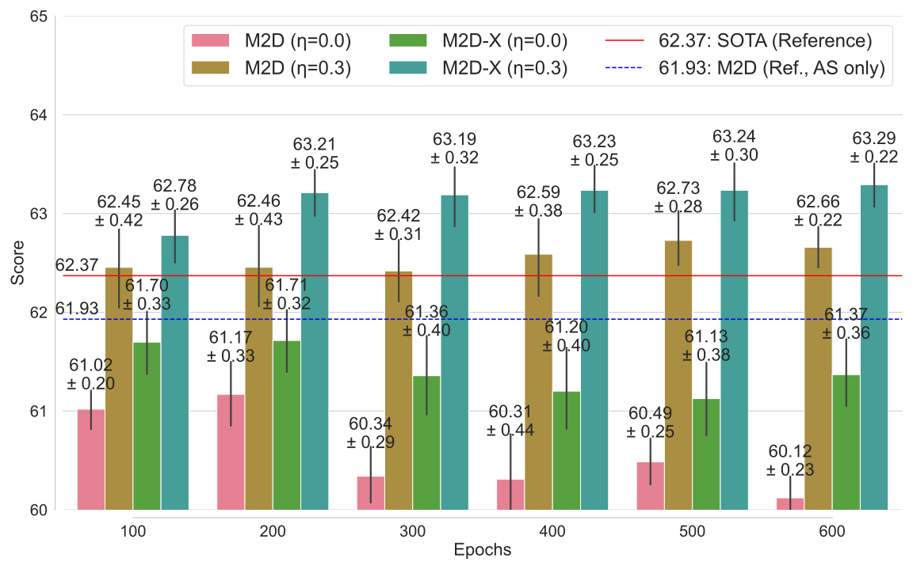

# M2D-X Applied on Respiratory Sound Tasks: ICBHI2017 & SPRSound

This sub-repository provides application examples in a realistic setting described in our [TASLP paper](https://ieeexplore.ieee.org/document/10502167).

```BibTeX
@article{niizumi2024m2dx,
    title   = {{Masked Modeling Duo: Towards a Universal Audio Pre-training Framework}},
    author  = {Daisuke Niizumi and Daiki Takeuchi and Yasunori Ohishi and Noboru Harada and Kunio Kashino},
    journal = {IEEE/ACM Trans. Audio, Speech, Language Process.},
    year    = {2024},
    volume  = {32},
    pages   = {2391-2406},
    url     = {https://ieeexplore.ieee.org/document/10502167},
    doi     = {10.1109/TASLP.2024.3389636}}
```

We applied the pre-trained models to respiratory sound tasks. While usually we fine-tune these models, we also further pre-train models on the application data that enhances the final performance (the step 2 below). The example contains data and test environmental setup, further pre-training steps, and fine-tuning steps.

<figure>
  
</figure>

Notably, the example follows the test setup compatible with previous studies, enabling comparison with SOTA. In addition, it runs on a smaller GPU RTX3090Ti (24GB).

# ISBHI2017

## 1. Data and test setup

### 1-1. Setup application files

In the `app/icbhi_sprs` folder, running the following steps will download and setup the application program files.

```sh
pip install torchinfo
git clone https://github.com/ilyassmoummad/scl_icbhi2017.git
cd scl_icbhi2017
git reset --hard 915c1120719a9357d662c5fe484bce7fbe845139
mv dataset.py augmentations.py utils.py losses.py args.py ..
mv data ..
mv main.py ../app_main.py
mv ce.py models.py ..
cd ..
patch -p2 < patch_scl_icbhi2017.diff
```

When you finish these steps, you will find many .py files and a folder:
- Program files: app/icbhi_sprs/{app_main.py, args.py, augmentations.py, ce.py, dataset.py, losses.py, models.py, utils.py}
- Data folder: app/icbhi_sprs/data

### 1-2. Download the ICBHI2017 data

In the `app/icbhi_sprs` folder, running the following steps will download and setup the ICBHI2017 data. The last step converts raw audios into spectrograms.

```sh
wget https://bhichallenge.med.auth.gr/sites/default/files/ICBHI_final_database/ICBHI_final_database.zip --no-check-certificate

unzip ICBHI_final_database.zip | awk 'BEGIN {ORS=" "} {if(NR%10==0)print "."}'
mv ICBHI_final_database/* data/ICBHI
rmdir ICBHI_final_database

python ../../wav_to_lms.py data/ICBHI ../../data/icbhi2017_lms
cp files_icbhi2017.csv ../../data/files_icbhi2017.csv
```

When you finish these steps, you will find the following:
- app/icbhi_sprs/data/ICBHI  -- For fine-tuning, the original data files.
- data/icbhi2017_lms         -- For further pre-training, the log-mel spectrogram (LMS) files.
- data/files_icbhi2017.csv   -- For further pre-training, the list of LMS files.

### 1-3. Download FSD50K and setup the data

We use FSD50K as the background noise for the further pre-training.

To create the log-mel spectrogram FSD50K files, follow the [steps in the main README](../../README.md#3-1-preparing-pre-training-data-samples).
When you finish, you will have the following:
- data/fsd50k_lms             -- For further pre-training, the log-mel spectrogram (LMS) files.
- data/files_f_s_d_5_0_k.csv  -- For further pre-training, the list of LMS files.

### 1-3. Download pre-trained weight

We use an M2D weight with an input size of 80x200 and a patch size of 16x4. Be sure to download the weight to your copy's M2D root folder.

```sh
cd (your M2D root folder)
wget https://github.com/nttcslab/m2d/releases/download/v0.1.0/m2d_vit_base-80x200p16x4-230529.zip
unzip m2d_vit_base-80x200p16x4-230529.zip
```

You will find `(your M2D root folder)/m2d_vit_base-80x200p16x4-230529/checkpoint-300.pth`.


## 2. Further pre-training

We pre-train the pre-trained model again to make it more suitable for the target application data distribution.

** *Be sure to move to your copy's M2D root folder before you run the following.* **

```sh
cd (your M2D root folder)

CUDA_VISIBLE_DEVICES=0 python train_audio.py --epochs 600 --resume m2d_vit_base-80x200p16x4-230529/checkpoint-300.pth --model m2d_x_vit_base --input_size 80x200 --patch_size 16x4 --batch_size 64 --accum_iter 2 --csv_main data/files_icbhi2017.csv --csv_bg_noise data/files_f_s_d_5_0_k.csv --noise_ratio 0.3 --save_freq 100 --eval_after 600 --seed 6 --teacher m2d_vit_base-80x200p16x4-230529/checkpoint-300.pth --blr 3e-4 --loss_off 1.
```

When you finish, you will find the further pre-trained model folder named `m2d_x_vit_base-80x200p16x4p16k-240514-MdfiDdffsd50ks6bs128a2lo1nr.3-e600` (`240514` will be the date you run).
The folder contains six checkpoint files for every 100 epochs.

In this step, the source `m2d_vit_base-80x200p16x4-230529` model pre-trained on AudioSet is further pre-trained using the files listed in `data/files_icbhi2017.csv`, making it more effective for solving ICBHI2017.


## 3. Fine-tuning

We are almost complete. The last step is fine-tuning in the app/icbhi_sprs folder.
Use your further pre-trained weight, such as `m2d_x_vit_base-80x200p16x4p16k-240514-MdfiDdffsd50ks6bs128a2lo1nr.3-e600/checkpoint-600.pth`:

** *Be sure to change the folder name to yours.* **

** *Be sure to move to your copy's M2D root folder before you run the following.* **

```sh
cd (your M2D root folder)/app/icbhi_sprs

CUDA_VISIBLE_DEVICES=0 python app_main.py --method sl --backbone m2d --epochs 150 --bs 64 --lr 5e-5 --freeze_embed --split_iter 4 --weightspath ../../m2d_x_vit_base-80x200p16x4p16k-240514-MdfiDdffsd50ks6bs128a2lo1nr.3-e600/checkpoint-600.pth
```

We appreciate the codebase [lyassmoummad/scl_icbhi2017](https://github.com/ilyassmoummad/scl_icbhi2017) from the following paper. We customized the code to load and fine-tune the M2D models.

- [Moummad and Farrugia, "Pretraining Respiratory Sound Representations using Metadata and Contrastive Learning," in WASPAA, 2023](https://arxiv.org/abs/2210.16192)

To iterate fine-tuning for getting a statistical result, we actually used a batch file instead of a raw command line.

```sh
bash eval_icbhi.sh ../../m2d_x_vit_base-80x200p16x4p16k-240514-MdfiDdffsd50ks6bs128a2lo1nr.3-e600/checkpoint-600.pth 5
```

The last `5` denotes the number of the fine-tuning iteration.

The results on the paper:
<figure>
  
</figure>

# SPRSound

## 4. SPRSound

For SPRSound, we use the same code while setting up the SPRSound data. 

### 4-1. Download SPRSound and setup data

In the `app/icbhi_sprs` folder, running the following steps will download the SPRSound data.

```sh
git clone https://github.com/SJTU-YONGFU-RESEARCH-GRP/SPRSound.git
(cd SPRSound && git reset --hard 45b0d5d435ff320c46585762fa1090afd0ebb318)
```

```sh
cp -r SPRSound/train_wav SPRSound/test_wav data/SPRS/
cp files_sprs.csv ../../data
python cut_data_sprs.py
```

When you finish these steps, you will find the following:
- app/icbhi_sprs/data/SPRS  -- For fine-tuning, the original data files.
- data/sprsound_lms         -- For further pre-training, the log-mel spectrogram (LMS) files.
- data/files_sprs.csv       -- For further pre-training, the list of LMS files.

### 4-2. Further Pre-training

** *Be sure to move to your copy's M2D root folder before you run the following.* **

```sh
cd (your M2D root folder)

CUDA_VISIBLE_DEVICES=0 python train_audio.py --epochs 600 --resume m2d_vit_base-80x200p16x4-230529/checkpoint-300.pth --model m2d_x_vit_base --input_size 80x200 --patch_size 16x4 --batch_size 64 --accum_iter 2 --csv_main data/files_sprs.csv --csv_bg_noise data/files_f_s_d_5_0_k.csv --noise_ratio 0.01 --save_freq 100 --eval_after 600 --seed 3 --teacher m2d_vit_base-80x200p16x4-230529/checkpoint-300.pth --blr 3e-4 --loss_off 1. --min_ds_size 0
```

### 4-3. Fine-tuning

To iterate fine-tuning for getting a statistical result, we used a batch file.

```sh
bash eval_sprs.sh ../../m2d_x_vit_base-80x200p16x4p16k-240514-MdfiDdffsd50ks6bs128a2lo1nr.3-e600/checkpoint-600.pth 5
```

The last `5` denotes the number of the fine-tuning iteration.

The results on the paper:
<figure>
  
</figure>


## Complete command lines

The command lines for reproduction follows.

### ICBHI2017

#### Further pre-training

```sh
# M2D-X, noise_ratio 0.3
CUDA_VISIBLE_DEVICES=0 python train_audio.py --epochs 600 --resume m2d_vit_base-80x200p16x4-230529/checkpoint-300.pth --model m2d_x_vit_base --input_size 80x200 --patch_size 16x4 --batch_size 64 --accum_iter 2 --csv_main data/files_icbhi2017.csv --csv_bg_noise data/files_f_s_d_5_0_k.csv --noise_ratio 0.3 --save_freq 100 --eval_after 600 --seed 6 --teacher m2d_vit_base-80x200p16x4-230529/checkpoint-300.pth --blr 3e-4 --loss_off 1.
# M2D-X, noise_ratio 0.0
CUDA_VISIBLE_DEVICES=0 python train_audio.py --epochs 600 --resume m2d_vit_base-80x200p16x4-230529/checkpoint-300.pth --model m2d_x_vit_base --input_size 80x200 --patch_size 16x4 --batch_size 64 --accum_iter 2 --csv_main data/files_icbhi2017.csv --csv_bg_noise data/files_f_s_d_5_0_k.csv --noise_ratio 0.0 --save_freq 100 --eval_after 600 --seed 6 --teacher m2d_vit_base-80x200p16x4-230529/checkpoint-300.pth --blr 3e-4 --loss_off 1.

We specifically leave our command lines for the random seed 3. We did them for all four seeds. 

# M2D, noise_ratio 0.3
CUDA_VISIBLE_DEVICES=0 python train_audio.py --epochs 600 --resume m2d_vit_base-80x200p16x4-230529/checkpoint-300.pth --model m2d_vit_base --input_size 80x200 --patch_size 16x4 --batch_size 64 --accum_iter 2 --csv_main data/files_icbhi2017.csv --csv_bg_noise data/files_f_s_d_5_0_k.csv --noise_ratio 0.3 --save_freq 100 --eval_after 600 --seed 3 --blr 3e-4 --loss_off 0.
# M2D, noise_ratio 0.0
CUDA_VISIBLE_DEVICES=0 python train_audio.py --epochs 600 --resume m2d_vit_base-80x200p16x4-230529/checkpoint-300.pth --model m2d_vit_base --input_size 80x200 --patch_size 16x4 --batch_size 64 --accum_iter 2 --csv_main data/files_icbhi2017.csv --csv_bg_noise data/files_f_s_d_5_0_k.csv --noise_ratio 0.0 --save_freq 100 --eval_after 600 --seed 3 --blr 3e-4 --loss_off 0.
```

#### Fine-tuning

We specifically leave our command lines for checkpoint-600.pth. We did them for all six checkpoints. 

```sh
# M2D-X, noise_ratio 0.3, random seeds 3 to 6
bash eval_icbhi.sh ../../m2d_x_vit_base-80x200p16x4-230814-Ddffsd50ks3blr0003bs128a2nr.3-e600/checkpoint-600.pth 5
bash eval_icbhi.sh ../../m2d_x_vit_base-80x200p16x4-230814-Ddffsd50ks4blr0003bs128a2nr.3-e600/checkpoint-600.pth 5
bash eval_icbhi.sh ../../m2d_x_vit_base-80x200p16x4-230814-Ddffsd50ks5blr0003bs128a2nr.3-e600/checkpoint-600.pth 5
bash eval_icbhi.sh ../../m2d_x_vit_base-80x200p16x4-230814-Ddffsd50ks6blr0003bs128a2nr.3-e600/checkpoint-600.pth 5
# M2D-X, noise_ratio 0.0, random seeds 3 to 6
bash eval_icbhi.sh ../../m2d_x_vit_base-80x200p16x4-230818-Ddffsd50ks3blr0003bs128a2nr0-e600/checkpoint-600.pth 5
bash eval_icbhi.sh ../../m2d_x_vit_base-80x200p16x4-230818-Ddffsd50ks4blr0003bs128a2nr0-e600/checkpoint-600.pth 5
bash eval_icbhi.sh ../../m2d_x_vit_base-80x200p16x4-230818-Ddffsd50ks5blr0003bs128a2nr0-e600/checkpoint-600.pth 5
bash eval_icbhi.sh ../../m2d_x_vit_base-80x200p16x4-230818-Ddffsd50ks6blr0003bs128a2nr0-e600/checkpoint-600.pth 5

# M2D, noise_ratio 0.3, random seeds 3 to 6
bash eval_icbhi.sh ../../m2d_vit_base-80x200p16x4-mix-230814-s3blr0003bs128a2MdfiDdffsd50knr.3-e600/checkpoint-600.pth 5
bash eval_icbhi.sh ../../m2d_vit_base-80x200p16x4-mix-230814-s4blr0003bs128a2MdfiDdffsd50knr.3-e600/checkpoint-600.pth 5
bash eval_icbhi.sh ../../m2d_vit_base-80x200p16x4-mix-230814-s5blr0003bs128a2MdfiDdffsd50knr.3-e600/checkpoint-600.pth 5
bash eval_icbhi.sh ../../m2d_vit_base-80x200p16x4-mix-230814-s6blr0003bs128a2MdfiDdffsd50knr.3-e600/checkpoint-600.pth 5
# M2D, noise_ratio 0.3, random seeds 3 to 6
bash eval_icbhi.sh ../../m2d_vit_base-80x200p16x4-mix-230814-s3blr0003bs128a2MdfiDdffsd50knr0-e600/checkpoint-600.pth 5
bash eval_icbhi.sh ../../m2d_vit_base-80x200p16x4-mix-230814-s4blr0003bs128a2MdfiDdffsd50knr0-e600/checkpoint-600.pth 5
bash eval_icbhi.sh ../../m2d_vit_base-80x200p16x4-mix-230814-s5blr0003bs128a2MdfiDdffsd50knr0-e600/checkpoint-600.pth 5
bash eval_icbhi.sh ../../m2d_vit_base-80x200p16x4-mix-230814-s6blr0003bs128a2MdfiDdffsd50knr0-e600/checkpoint-600.pth 5
```
### SPRSound

#### Further pre-training

We specifically leave our command lines for the random seed 3. We did them for all four seeds. 

```sh
# M2D-X, noise_ratio 0.3
CUDA_VISIBLE_DEVICES=0 python train_audio.py --epochs 600 --resume m2d_vit_base-80x200p16x4-230529/checkpoint-300.pth --model m2d_x_vit_base --input_size 80x200 --patch_size 16x4 --batch_size 64 --accum_iter 2 --csv_main data/files_sprs.csv --csv_bg_noise data/files_f_s_d_5_0_k.csv --noise_ratio 0.01 --save_freq 100 --eval_after 600 --seed 3 --teacher m2d_vit_base-80x200p16x4-230529/checkpoint-300.pth --blr 3e-4 --loss_off 1. --min_ds_size 0
# M2D-X, noise_ratio 0.0
CUDA_VISIBLE_DEVICES=0 python train_audio.py --epochs 600 --resume m2d_vit_base-80x200p16x4-230529/checkpoint-300.pth --model m2d_x_vit_base --input_size 80x200 --patch_size 16x4 --batch_size 64 --accum_iter 2 --csv_main data/files_sprs.csv --csv_bg_noise data/files_f_s_d_5_0_k.csv --noise_ratio 0.0 --save_freq 100 --eval_after 600 --seed 3 --teacher m2d_vit_base-80x200p16x4-230529/checkpoint-300.pth --blr 3e-4 --loss_off 1. --min_ds_size 0
```

#### Fine-tuning

We specifically leave our command lines for checkpoint-600.pth. We did them for all six checkpoints. 

```sh
# M2D-X, noise_ratio 0.01, random seeds 3 to 6
bash eval_sprs.sh ../../m2d_x_vit_base-80x200p16x4-240222-MdfsDdffsd50ks3blr0003bs128a2lo0nr01dn0-e600/checkpoint-600.pth 5
bash eval_sprs.sh ../../m2d_x_vit_base-80x200p16x4-240222-MdfsDdffsd50ks4blr0003bs128a2lo0nr01dn0-e600/checkpoint-600.pth 5
bash eval_sprs.sh ../../m2d_x_vit_base-80x200p16x4-240222-MdfsDdffsd50ks5blr0003bs128a2lo0nr01dn0-e600/checkpoint-600.pth 5
bash eval_sprs.sh ../../m2d_x_vit_base-80x200p16x4-240222-MdfsDdffsd50ks6blr0003bs128a2lo0nr01dn0-e600/checkpoint-600.pth 5
# M2D-X, noise_ratio 0.0, random seeds 3 to 6
bash eval_sprs.sh ../../m2d_x_vit_base-80x200p16x4-240223-MdfsDdffsd50ks3blr0003bs128a2lo0nr0dn0-e600/checkpoint-600.pth 5
bash eval_sprs.sh ../../m2d_x_vit_base-80x200p16x4-240223-MdfsDdffsd50ks4blr0003bs128a2lo0nr0dn0-e600/checkpoint-600.pth 5
bash eval_sprs.sh ../../m2d_x_vit_base-80x200p16x4-240223-MdfsDdffsd50ks5blr0003bs128a2lo0nr0dn0-e600/checkpoint-600.pth 5
bash eval_sprs.sh ../../m2d_x_vit_base-80x200p16x4-240223-MdfsDdffsd50ks6blr0003bs128a2lo0nr0dn0-e600/checkpoint-600.pth 5
```
