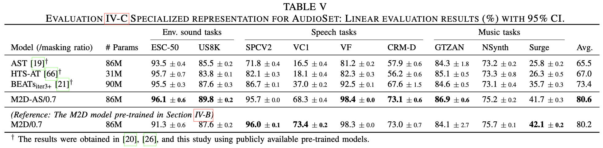
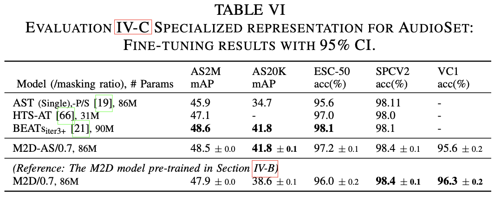

# M2D-AS (M2D-X specialized in AudioSet)

This sub-repository describes the steps to reproduce M2D-AS pre-training from our [following paper](https://ieeexplore.ieee.org/document/10502167): create a metadata file containing labels and run the pre-training.

```BibTeX
@article{niizumi2024m2dx,
    title   = {{Masked Modeling Duo: Towards a Universal Audio Pre-training Framework}},
    author  = {Daisuke Niizumi and Daiki Takeuchi and Yasunori Ohishi and Noboru Harada and Kunio Kashino},
    journal = {IEEE/ACM Trans. Audio, Speech, Language Process.},
    year    = {2024},
    volume  = {32},
    pages   = {2391-2406},
    url     = {https://ieeexplore.ieee.org/document/10502167},
    doi     = {10.1109/TASLP.2024.3389636}}
```

## 1. Creating a metadata file

1. Make a list of AudioSet files as "data/files_audioset.csv" for the M2D pre-training by following "Example preprocessing steps (AudioSet)" in data/README.
2. In the M2D folder, create "data/files_as_weighted.csv" containing both sample path and labels (and also sample weights) as follows.

    python util/make_as_weighted_list.py

You should have a file `data/files_as_weighted.csv`.

## 2. Conduct M2D-AS pre-training

The exact pre-training command line we used is as follows:

```shell
OMP_NUM_THREADS=1 torchrun --nproc_per_node=4 -m audioset.train_as --input_size 80x608 --patch_size 16x16 --epochs 300 --batch_size 512 --accum_iter 1 --save_freq 50 --seed 3 --loss_off 1.
```

It requires 4x 48 GB GPU (for about two days), and the following should allow pre-training with 4x 24 GB GPU (3090Ti) within a week.

```shell
OMP_NUM_THREADS=1 torchrun --nproc_per_node=4 -m audioset.train_as --input_size 80x608 --patch_size 16x16 --epochs 300 --batch_size 256 --accum_iter 2 --save_freq 50 --seed 3 --loss_off 1.
```

## Results on the paper

<figure>
  
</figure>

<figure>
  
</figure>

