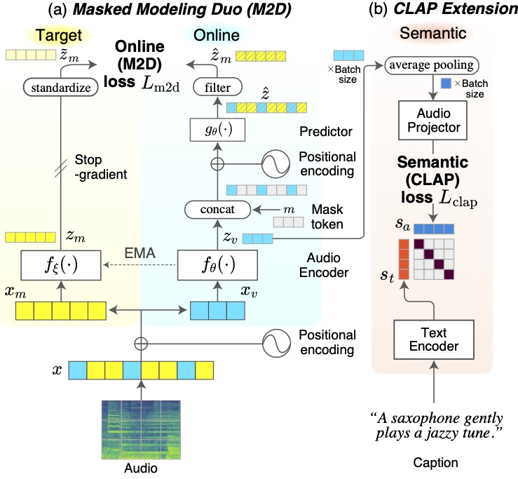
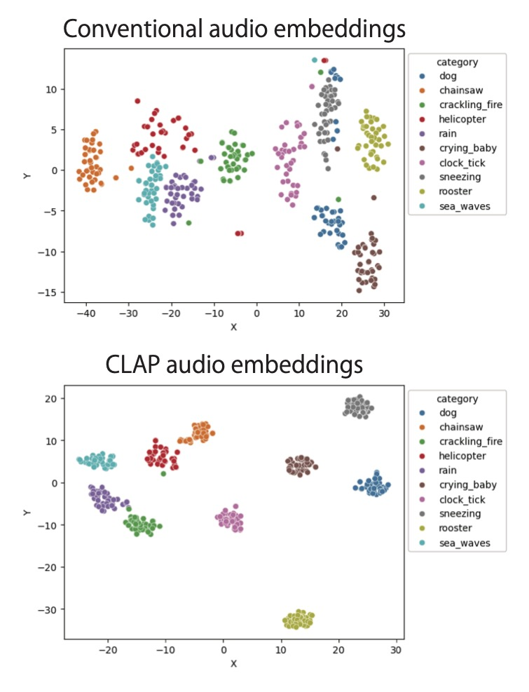
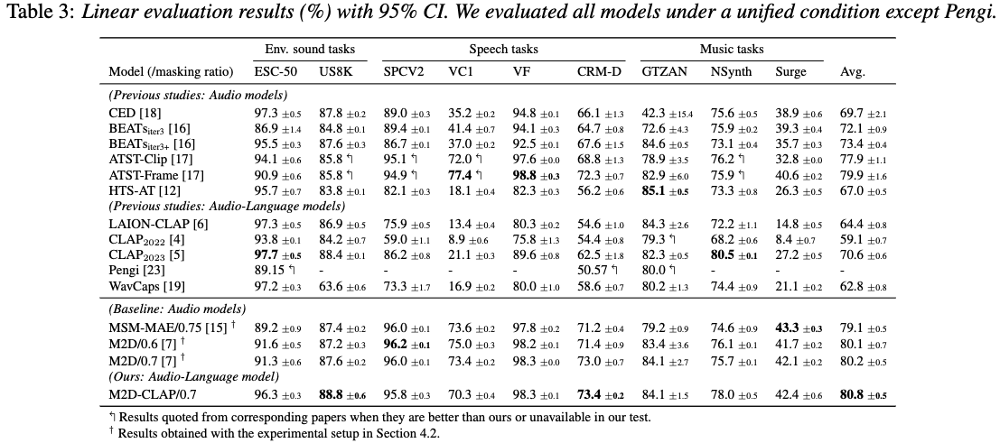
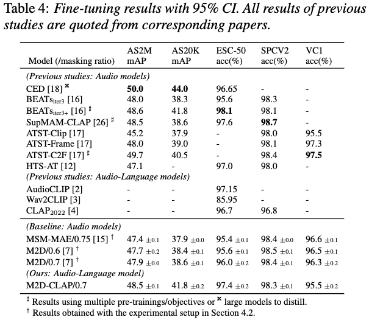
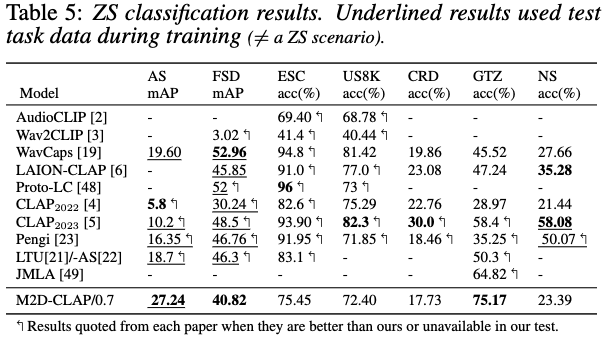

# M2D-CLAP: Masked Modeling Duo Meets CLAP for Learning General-purpose Audio-Language Representation

<figure>
  
</figure>

This sub-repository provides codes for [our Interspeech 2024 paper](https://arxiv.org/abs/TBD), including the setup procedure for the training caption data and the pre-training steps.

```bibtex
@article{niizumi2024m2d-clap,
    title   = {{M2D-CLAP: Masked Modeling Duo Meets CLAP for Learning General-purpose Audio-Language Representation}},
    author  = {Daisuke Niizumi and Daiki Takeuchi and Yasunori Ohishi and Noboru Harada and Masahiro Yasuda and Shunsuke Tsubaki and Keisuke Imoto},
    journal = {to appear at Interspeech},
    year    = {2024},
    url     = {https://arxiv.org/abs/2406.02032}}
```

## 1. Setup

Our implementation does not convert texts into sentence (semantic) embeddings on the fly. Instead, we convert them into embeddings in advance (offline) at the following steps 2 and 3.

1. Prepare for the M2D pre-training on AudioSet by following the [3. Pre-training From Scratch](../README.md#3-pre-training-from-scratch).
    - Especcially, configure data/audioset_lms according to the [Example preprocessing steps (AudioSet)](../data/README.md#example-preprocessing-steps-audioset).
2. Run `Note-AutoACD-GTEbase.ipynb` to create `data/capemb_GTEbase_Audo_A_C_D.npy` for [Auto-ACD](https://auto-acd.github.io/) captions.
3. Run `Note-ACalt4_GTEbase.ipynb` to create `data/capemb_GTEbase_AC_alt_4.npy` for [AudioCaps Alternative 4 Captions (ACalt4)](https://github.com/KeisukeImoto/ACalt4).

In summary, the following data should be ready.

- `data/audioset_lms` -- The log-mel spectrogram audio samples (many .npy files)
- `data/files_audioset.csv` -- The list of the samples in the `data/audioset_lms`.
- `data/capemb_GTEbase_Audo_A_C_D.npy` -- The caption embeddings of AutoACD.
- `data/capemb_GTEbase_AC_alt_4.npy` -- The caption embeddings of ACalt4.

## 2. Pre-training

The exact pre-training command line we used is as follows:

```shell
OMP_NUM_THREADS=1 torchrun --nproc_per_node=4 -m semantics.train_clap --input_size 80x608 --patch_size 16x16 --epochs 300 --batch_size 512 --accum_iter 1 --save_freq 50 --seed 3 --model m2d_clap_vit_base --file_caption data/capemb_GTEbase_Audo_A_C_D.npy,data/capemb_GTEbase_AC_alt_4.npy --loss_off .01
```

## 3. Evaluation

Quick example: [examples/Example_4_CLAP.ipynb](../examples/Example_4_CLAP.ipynb).

The evaluation steps follow the [original M2D](../README.md#2-evaluating-m2d).

For the zero-shot evaluation, refer to the [../all_eval.sh](../all_eval.sh), which contains all the command lines exactly used for the paper.

## AudioCaps Alternative 4 Captions (ACalt4)

Refer to the repository [ACalt4](https://github.com/KeisukeImoto/ACalt4) for the details.

## Examples

| Description | Notebook |
|:------------|:---------|
| Zero-shot ESC-50 classification with M2D-CLAP | [ examples/Colab_M2D-CLAP_ESC-50_ZS.ipynb](http://colab.research.google.com/github/nttcslab/m2d/blob/master/examples/Colab_M2D-CLAP_ESC-50_ZS.ipynb) |
| Audio feature visualization example with M2D-CLAP | [ examples/Colab_M2D-CLAP_ESC-50_VizualizeEmbs.ipynb](http://colab.research.google.com/github/nttcslab/m2d/blob/master/examples/Colab_M2D-CLAP_ESC-50_VizualizeEmbs.ipynb) |

### t-SNE visualization of ESC-10 samples

The t-SNE visualization of the audio embeddings encoded by M2D-CLAP. The conventional audio embeddings are the output of the audio encoder for transfer learning. The CLAP audio embeddings are the output of the audio projector for ZS inference.

<figure>
  
</figure>

## Results on the paper

<figure>
  
</figure>

<figure>
  
</figure>

<figure>
  
</figure>
